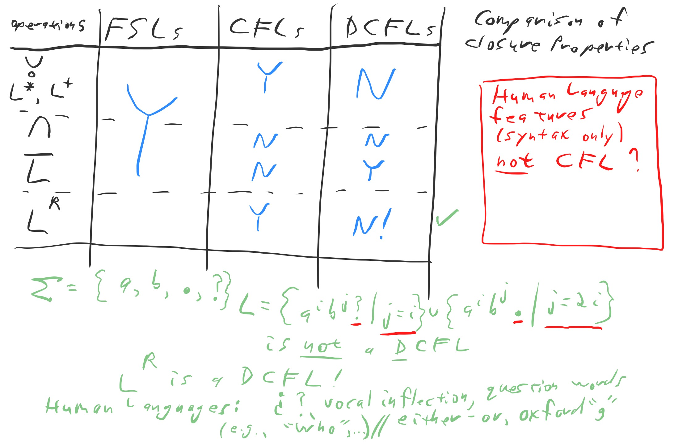

## Chapter 0
#### Set
* $A \subsetneq B$ - $A$ is proper subset of $B$ (is a subset but NOT equal)
* Order of elements wthin the set does NOT matter
* singleton set - set with one element
* Power set: e.g. $A = \{0, 1\}, \text{power set} = \{ \emptyset, \{0\}, \{1\}, \{0, 1\} \}$

#### Tuple
* Tuple is a Finite sequence
* A 2-tuple is an ordered pair
* $A \times B$ - Cartesian product (or cross product) of $A, B$ is the set of all ordered pairs

#### Predicate (or property)
* a function whose range is $\{TRUE, FALSE\}$

#### Equivalence Relationship

* $R$ is reflexive if for every $x$, $xRx$
* $R$ is symmetric if for every $x, y$, $xRy$ implies $yRx$
* $R$ is transitive if for every $x, y, z$, $xRy$ and $yRz$ implies $xRz$

#### Alphabet $\Sigma, \Gamma$
* Any nonempty finite set
* Members of the alphabet are its symbols
* $\Sigma = \{0, 1\}$
* $\Sigma^+ = \{$All words over $\Sigma\}$
* $\#(a, w) =$ the number of occurrences of symbol $a$ in wordstring $w$
* a run of $a$ in $w$ is a substring of $w$ such that it consists of only symbols in $a$ and there are no adjacent $a$'s
  * e.g. $aaabccca$ contains 2 runs of $a$, 1 run of $b$, and 1 run of $c$ (of length 3)
  * $c$ and $cc$ are NOT runs of $c$
  * $bcc$ are NOT runs

#### Basics

* **Cartesian Product**: $Q = Q_1 \times Q_2 = \{(r_1, r_2)| r_1 \in Q_1$ and $r_2 \in Q_2\}$
* **Concatenation** $A \circ B = \{xy| x \in A\ \text{and}\ y \in B \}$
* **Union**: $A \cup B = \{x| x \in A\ \text{or}\ x \in B \}$
* **Star**: $A^* = \{x_1x_2...x_k| k \ge 0\ \text{and each}\ x_i \in A\}$
  * Note that each $x_i$ can be different

## Chapter 1
#### Finite Automaton [P35]

a 5-tuple $(Q, \Sigma, \delta, q_0, F)$
1. $Q$: States, a finite set
2. $\Sigma$: Alphabet, a finite set
3. $\delta$: Transition Function, $\delta: Q \times \Sigma \rightarrow Q$
4. $q_0 \in Q$: start state
5. $F \subseteq Q$: set of accept states

* Finite Automaton is represented by State Diagram
* Arrows from one state to another are **transitions**
* Transition function $\delta$ inputs a state and a signal, and outputs the next states

#### Non-determinism [P53]
* Deterministic computation: Given a state and the next input symbol, we know the next state
* Non-determinism generalizes determinism: Every deterministic finite automaton is automatically a nondeterministic finite automaton

1. Search NFA Digraph for path from $q$ to any $q \in F$
2. Every time we come to a nondeterministic choice, consider both paths in parallel
   1. From then on similar to consider tree of all possible computations
3. Guess & Check: NFA guesses which choices will lead to accepting states
4. Choosy generator

#### NFA
Let $N = (Q, \Sigma, \delta, q_0, F)$ be an NFA and $w$ a string over the alphabet $\Sigma$. Then we say that $N$ accepts $w$ if we can write $w$ as $w = y_1y_2 ... y_m$, where each $y_i$ is a member of $\Sigma_\epsilon$ and a sequence of states $r_0,r_1,..., r_m$ exists in $Q$ with three conditions:
1. $r_0 = q_0$
2. $r_{i+1} \in \delta(r_i, y_{i+1})$ for $i = 0, ... m−1$ 
3. $r_m \in F$

Note that $\delta(r_i, y_{i+1})$ is the **set** of allowable next states

#### NFA vs DFA [P48]
* For DFA, every state has exactly one exiting transition arrow for each symbol in the alphabet
* For NFA, a state may have zero, one, or many exiting arrows for each alphabet symbol
* NFA can have arrows with members of the alphabet or $\epsilon$
* Every NFA can be converted into an equivalent DFA; the DFA may have many more states

#### Equivalence of NFA and DFA 
Theorem: For every NFA $N = (Q, \Sigma, \delta, q_0, F)$, there exists a DFA $M = (Q', \Sigma, \delta', q_0', F')$, such that $L(M) = L(N)$

* $L(N)$ - language accepted by $N$

Claim: For any NFA, $\exists$ an equivalent NFA without $\epsilon$-moves

During an NFA computation, at each step there are only a finite number $|Q|$ of different states that $N$ can be in.

At every step, $N$ can be in a subset of the states of $Q$, and the set of subsets is also a finite set.

We can use the power set of $Q$ to track the states the NFA can be in. Define DFA $M = (Q', \Sigma, \delta', q_0', F')$, where:
* $Q = \mathcal{P}(Q)$, the power set of the states of NFA $N$
* $q_0' = \{ q_0 \}$. Every state is represented by a set of states of the machine we start with ($N$)
* $F' = \{ r \subseteq Q | R$ contains at least one member of $F$ = accepting state of $Q \}$
* $\delta': Q' \times \Sigma \rightarrow Q'$ (same as $\mathcal{P}(Q) \times \Sigma \rightarrow \mathcal{P}(Q)$)
* For all $R \in Q'$ ($R \subseteq Q$) and symbol $a \in \Sigma$, $\delta'(R, a) = \{q \in Q |$ for some state $r \in R \subseteq Q, \delta(r, a)$ contains $q \}$. Note: this output is a **set of state**
* $R$ represents all states $N$ could be in at a given step of the computation

If $N$ accepts string $w$, then $M$ will accepting $w$ because at least one computation by $N$ will lead to an accepting state. So the computation by $M$ will lead to a state representing a set of states of $N$

If $N$ does NOT accept string $w$, then no computation of $N$ leads to an accepting state. So the computation by $M$ will NOT result in a state of $M$ representing a set of $N$ that contains an accepting state of $N$.

## Regular Language [P63]
$R$ is a regular expression if $R$ is 
* $a$ for some $a \in \Sigma$ | language $\{a\}$
* $\varepsilon$ | language $\{\varepsilon\}$
* $\emptyset$
* $R_1 \cup R_2$, where $R_1$ and $R_2$ are regex
* $R_1 \circ R_2$, where $R_1$ and $R_2$ are regex
* $R_1^*$, where $R_1$ is regex

#### Closure of Regular Language [P59]
Regular language is Closed under 
* union $L_1 \cup L_2$
* concatenation: $L_1 \circ L_2$
* Kleene star/plus: $L_1^*$, $L_1^+$
* difference, Kleene closure

Special case
* Complementation $L_1^C$
* Reversal $L_1^R$
* if $L_1$ is NOT FSL, then $L_1^C$ and $L_1^R$ are also NOT FSL

Prove a language is not regular using closure property (proof by contradiction):
* Assume a language $L$ is regular
* Apply operation to that language with a well-known language that is regular
* Obtain a new language that is well known as not regular
* Conclude the original language $L$ is not regular

* Any regular expression can be converted into a finite automaton that recognizes the language it describes, and vice versa

#### Finite-State Languages
* Languages recognized by DFA
* There exists some **DFA** $M$ that accepts all $M \in L$ and rejects all $M \notin L$

#### Regular Language Identity Operations [P66]
* $R \cup \emptyset = R$
* $R \circ \varepsilon = R$
* NOTE: $R \circ \emptyset = \emptyset, R \times \emptyset = \emptyset$

#### Empty set vs empty word
* $\varepsilon$ - language containing a single string — the empty string
* $\emptyset$ - the language that doesn’t contain any strings
* $\{\} \ne \epsilon$. $\epsilon$ is an empty word. $\{\}$ is the empty set, a language with NO word, which cannot contain $\epsilon$. 

#### GNFA | Generalized Non-deterministic Finite Automata [P70]
* NFA wherein the transition arrows may have any regular expressions as labels, instead of only members of the alphabet or $\varepsilon$
* Start state has transition arrows going to every other state, but no arrows coming in from any other state
* Transition function $\delta: (Q - \{q_{accept}\}) \times (Q - \{q_{start}\}) \rightarrow \mathcal{R}$
* There is only 1 accept state with arrows from every other state but no arrows going to any other state 
* accept state $\ne$ start state
* Except the start and accept states, one arrow goes from every state to every other state and also from each state to itself

GNFA accepts a string $w \in \Sigma^*$ if $w = w_1w_2, ...w_k$, where each $w_i \in \Sigma^*$ and a sequence of states $q_0, q_1, ..., q_k$ exists such that
1. $q_0 = q_{start}$
2. $q_k = q_{accept}$
3. $\forall i$, we have $w_i \in L(R_i)$, where $R_i = \delta(q_{i−1}, q_i)$ ($R_i$ is the expression on the arrow from $q_{i−1}$ to $q_i$)

#### Pumping Lemma for Regular Language [P78]
Each string contains a section with pumping length $p$ that can be repeated any number of times with the resulting string remaining in the language 

Let $p$ be the pumping length. $s$ can be written as $s = xyz$, where:
1) for each $i \ge 0$, $xy^iz \in A$
2) $|y| = m > 0$ 
3) $|xy| \le p$

Note: $x, z$ can be $\epsilon$, but $y \ne \epsilon$

### CFG | Context-Free Language [P102]

a 4-tuple $G = (V, \Sigma, R, S)$, where
1. $V$ is a finite set called the variables,
2. $\Sigma$ is a finite set, disjoint from $V$, called the terminals,
3. $R$ is a finite set of rules, with each rule being a variable and a
string of variables and terminals
    e.g. $A \rightarrow 0A1$
4. $S \in V$ is the start variable.

e.g. $A \rightarrow 0A1 | B$
* $V = \{A, B\}$
* $\Sigma = \{0, 1, \#\}$
* $S = \{A \rightarrow 0A1, A \rightarrow B, B \rightarrow \# \}$

Variables are in capital letters ($A, B$)  
Terminals are lower-cased ($0, 1, \#$)  

Note: $V \cap \Sigma = \{ \}$, $S \in V$

#### Derivation
* The sequence of substitution to obtain a string
* $u$ derives $v$ if a sequence $u_1 \implies u_2 \implies ... \implies u_k \implies v$ exists for $k \ge 0$
* $\implies$ means "yields"
* Ambiguous derivation: A string $w$ is derived ambiguously in context-free grammar $G$ if it has $\ge 2$ different leftmost derivations
* If there is $>1$ parse tree for $s \in L$, we say that "$s$ is ambiguous in $G$
* If $G$ has **any** ambiguous string (generates some string ambiguously), we say "$G$ is ambiguous" or "$G$ is an ambiguous grammar"
* If **every** grammar for $L$ must be ambiguous, we say "$L$ is an inherently ambiguous language"
* **Leftmost derivation**: At every step the leftmost remaining variable (nonterminal) is the one replaced.

[e.g.] 
$\Sigma = \{ a, b, c\}, L = \{a^ib^jc^k|i=j \text{or} j=k \}$ is a CFL strings with $i=j=k$.
Will always be generated ambiguously in any grammar for $L$. $L$ is an inherently ambiguous language.

#### Example | Ambiguous grammar

Unambiguous: X is a subroutine

$R \rightarrow AR | X$

$X \rightarrow XB | \varepsilon$

Ambiguous:

$R \rightarrow AR | RB | \varepsilon$

#### Chomsky Normal Form [P109]
* $A \rightarrow BC$
* s$A \rightarrow a$

#### Closure of CFL
CFL is closed under
##### 1. Union
$G=\left(V_{1} \cup V_{2} \cup\{S\}, \Sigma_{1} \cup \Sigma_{2}, R, S\right)$ where $R=R_{1} \cup R_{2} \cup\left\{S \rightarrow S_{1}, S \rightarrow S_{2}\right\}$
and $S$ is a new symbol.
Then $L(G)=L(G_{1}) \cup L(G_{2})$

Example:
$$
S \rightarrow S_{1} \\
S \rightarrow S_{2} \\
S_{1} \rightarrow a S_{1} b \\
S_{1} \rightarrow \epsilon \\
S_{2} \rightarrow c S_{2} d \\
S_{2} \rightarrow \epsilon . \\
$$
Then $L(G)=\{a^{n} b^{n}: n \geq 0\} \cup\{c^{n} d^{n}.: n \geq 0\}$

##### 2. Concatenation

$G=\left(V_{1} \cup V_{2} \cup\{S\}, \Sigma_{1} \cup \Sigma_{2}, R, S\right)$ where $R=R_{1} \cup R_{2} \cup\left\{S \rightarrow S_{1} S_{2}\right\}$ and $S$
is a new symbol. Example:
$$
S \rightarrow S_{1} S_{2} \\
S \rightarrow \epsilon . \\
S_{1} \rightarrow a S_{1} b \\
S_{1} \rightarrow \epsilon . \\
S_{2} \rightarrow c S_{2} d \\
$$
Then $L(G)=\{a^{m} b^{m} c^{n} d^{n}: m, n \geq 0$

##### 3. Kleene Star

$G=\left(V_{1} \cup\{S\}, \Sigma_{1}, R, S\right)$ where $R=R_{1} \cup\left\{S \rightarrow \epsilon, S \rightarrow S S_{1}\right\}$ and $S$ is a new symbol. 

Example:
$$
S_{1} \rightarrow a S_{1} b \\
S_{1} \rightarrow \epsilon \\
S \rightarrow \epsilon \\
S \rightarrow S S_{1}
$$
Then $L(G)=\{a^{n} b^{n}: n \geq 0\}^{*}$

CFL are NOT closed under
##### 1. Intersection: 
$L_1 \cap L_2$. True for $L_1$ (CFG or Regular language) and $L_2$ (CFG)
##### 2. Complement

#### PDA | Pushdown Automata [P113]

A 6-tuple $(Q, \Sigma, \Gamma, \delta, q_{0}, F)$, where $Q, \Sigma, \Gamma, F$ are all finite sets, and
1. $Q$ is the set of states
2. $\Sigma$ is the input alphabet 
3. $\Gamma$ is the stack alphabet ($\Gamma_\varepsilon = \Gamma \cup \{\varepsilon\}$ $\Gamma$ does NOT contain $\varepsilon$)
4. $\delta: Q \times \Sigma_{\varepsilon} \times \Gamma_{\varepsilon} \rightarrow \mathcal{P}(Q \times \Gamma_{\varepsilon})$ is the transition function
5. $q_{0} \in Q$ is the start state
6. $F \subseteq Q$ is the set of accept states

$a, b \rightarrow c$: when the machine is reading an $a$ from the input, it may replace the symbol $b$ on the top of the stack with a $c$
* **stack** = String of symbols from stack alphabet $\Gamma$
* The **stack** specifies writing as pushing the symbol
* PDA may be nondeterministic
* A language is context free iff some **PDA** recognizes it

Possible moves of **Input Tape** at each step:
* **Read** one symbol $w_i \in \Sigma$
* **Ignore** input tape ("$\epsilon$-move")
and move to next state (non-deterministically)

Possible move of **Stack** at each step:
* Push new symbol $b$ on top of $a$
* Pop $a$
* Swap: Replace $a \rightarrow b$
* Peak (Examine Top of Stack. No change)

$a \in \Gamma, b=\varepsilon$ 

Pop a, may depend on value of $a$ = top of stack 

$a=\varepsilon, b \in \Gamma$

Push $b$ onto top of stack with no regard to top of stack ($a=\varepsilon$ means "don't care" about top of stack)

$a=\varepsilon, b=\varepsilon$

depend on value of symbol at top of stack and no action on stack (may consume input)

$a \in \Gamma, b \in \Gamma$
1. $\mathrm{b} \neq \mathrm{a}$

Move may depend on value $\mathrm{a}$ = top of stack, and $\mathrm{b}$ replaces a on top of stack (pop & push)

2. $\mathrm{b} = \mathrm{a}$

Move may depend on value of $\mathrm{a}$ at top of stack and no action on stack (may consume input)

#### PDA diagram
PDA diagram is a labeled digraph similar to NFA, but we need to add notation for stack operations

$q_1 \xrightarrow{w_i, a \rightarrow b} q_2$

On input symbol $w_i \in \Sigma$, read $w_i$. If top of stack = stack symbol $a \in \Gamma$, PDA can remove $a$ from top of stack and replace it with stack symbol $b \in \Gamma$ and then go to next state $q_2$
* $w_i, a$ are input to $\delta$
* $b$ is the output
* $w_i, a, b$ can ALL be $\epsilon$
* if $w_i = \epsilon$, think of it as "don't care"

#### Pumping Lemma for CFG
If $A$ is a CFL, there exists $p$ (the pumping length) where if $s \in A$ and $|s| \ge p$, $s$ can be written as $s = uvxyz$, where:
1) for each $i \ge 0$, $s = uv^ixy^iz \in A$
2) $|vy| > 0$ ($v$ or $y$ is NOT the empty string)
3) $|vxy| \le p$

#### Example for Pumping Lemma on CFG
Prove $L = \{a^nb^nc^n | n \ge 0\}$

Suppose $L$ were CFL, then Pumping Lemma would apply

Let $p$ be the number in the lemma. And let $s = a^pb^pc^p$. Since $|s| > p$, we can write $s=uvxyz$ such that 
* $|vy| \ge 1$
* $|vxy| \le p$
* for all $i \ge 0$, $s = uv^ixy^iz \in L$

There are three blocks in the string: $s = a..a b..b c..c$

Since $|vxy| \le p$, it cannot straddle all three blocks. So when we create $uv^ixy^iz, i \ne 1$, there will always be one unaffected block. So that block will have $p$ symbols.

In the straddle case: $a^pb^pc^p$

Since $vxy$ contains two kinds of symbols, say $a \& b$, it could happen that $s'$ has the symbols out of order. e.g. $aaa\ ab\ ab\ bbb\ cccc$

#### DPDA | Deterministic Pushdown Automata [P130]
A 6-tuple $P = (Q, \Sigma, \Gamma, \delta, q_{0}, F)$, where $Q, \Sigma, \Gamma, F$ are all finite sets, and
1. $Q$ is the set of states
2. $\Sigma$ is the input alphabet 
3. $\Gamma$ is the stack alphabet ($\Gamma_\varepsilon = \Gamma \cup \{\varepsilon\}$)
4. $\delta: Q \times \Sigma_{\varepsilon} \times \Gamma_{\varepsilon} \rightarrow (Q \times \Gamma_{\varepsilon}) \times \{ \emptyset \}$ is the transition function
5. $q_{0} \in Q$ is the start state
6. $F \subseteq Q$ is the set of accept states

$\delta (q_{cur}, a_{input}, x_{pop}) = (r_{next}, y_{push})$

The transition function must satisfies that $\forall q \in Q, a \in \Sigma, x \in \Gamma$, exactly one of the following is not $\emptyset$: 
* $\delta (q, a, x)$
* $\delta (q, a, \varepsilon)$
* $\delta (q, \varepsilon, x)$
* $\delta (q, \varepsilon, \varepsilon)$

The language of **DPDA** is **DCFL**

A **DPDA** may fail to read the entire input if
* **Hanging**: it tries to pop an empty stack
  * Solved by initializing stack with special symbol \$
* **Looping**: it makes an endless sequence of $\varepsilon$-input moves
  * Solved by identifying the looping condition

#### Example | Bracket Language

#### Closure of DCFL
DCFL is closed under:
* $\cup$ Union, $\circ$ Concatenation, $L^*$ Kleene Star
* $\bar{L}$ Complement

DCFL is NOT closed under:
* $L^R$ reversal
* $\cap$ Intersection

#### Reduction [P135]
* Reduce step: the string of **terminals** and **variables** on the RHS of a rule is replaced by **variables** on LHS
* $u \xmapsto{*} v$: $v$ can be obtained from $u$ by a reduce step. $u$ is reducible to $v$
* $v \xRightarrow{*} u$
* **Left-most reduction**: Each reducing string is replaced only after all other reducing strings to the left of that reduction has been replaced
* A **Left-most reduction** corresponds to a machine that reads its input from left to right

For example:
* $w \xmapsto{*} S\underline{SS} \mapsto \underline{SS} \mapsto S$
* $w \xmapsto{*} \underline{SS}S \mapsto \underline{SS} \mapsto S$
* These two reducing strings overlap, so neither is entirely to the left of the other.
* So both are valid **Left-most reductions**

#### Handle [P136]
* a handle of a string $u_i$ (aka the replaced string / reducing string) that appears in a leftmost reduction of $w \in L(G)$ is the occurrence of the reducing string in $u_i$, together with the reducing rule for $u_i$ in this reduction.
* Handles are only defined for valid string
* A string that appears in a leftmost reduction of some string in $L(G)$ is called a valid string
* A valid string may have several handles, but only if the grammar is **ambiguous**
* A handle $h$ of a valid string $v = xhy$ is a forced handle if $h$ is the unique handle in every valid string $xh\hat{y}$ where $\hat{y} \in \Sigma^*$

#### DCFG | Deterministic Context-free Grammar [P138]
* a context-free grammar such that every valid string has a forced handle.

#### DK-Test
Starting with a CFG $G$, construct the associated **DFA** $DK$. Determine whether $G$ is deterministic by examining $DK$’s accept states. 

Every **accept state** contains
1. Exactly one completed rule
2. No dotted rule in which a terminal symbol immediately follows the dot (No dotted rule of the form $B \rightarrow u.av$ for $a \in \Sigma$

# Church-Turing Thesis

## Turing Machine [P168]
A 7-tuple, $(Q, \Sigma, \Gamma, \delta, q_{0}, q_{\text {accept }}, q_{\text {reject }})$ where $Q, \Sigma, \Gamma$ are all finite sets and
1. $Q$: set of states
2. $\Sigma$: input alphabet, which does NOT contain the **blank symbol** $\sqcup$
3. $\Gamma$: tape alphabet, where $\sqcup \in \Gamma$ and $\Sigma \subseteq \Gamma$
4. $\delta(q, a)$: transition function, $\delta: Q' \times \Gamma \longrightarrow Q \times \Gamma \times\{\mathrm{L}, \mathrm{R}\}$
   1. $\delta(q, a) = (r, b, L)$, the machine writes the symbol $b$ by replacing $a$, and transitions into state $r$ from $q$
   2. $Q' = Q$ \ $\{q_{accept}, q_{reject}\}$
5. $q_{0} \in Q$ is the start state,
6. $q_{\text {accept }} \in Q$ is the accept state, and
7. $q_{\text {reject }} \in Q$ is the reject state, where $q_{\text {reject }} \neq q_{\text {accept }}$

* The first $\sqcup$ marks the right-hand end of the input
* The machine stays in the same place if the machine tries to move its head beyond the left-hand end of the tape
* In Turing Machine, if you go into an **accept state**, we are done. There is NO back and forth between states. Same for **reject** state.
* Turing Operation: Accept / Reject / Loop
* All languages that can be represented by **TM** (including FSL, CFL) are **Recursively Enumerable Languages**
* This includes **Recursive Languages**
* **blank symbol** $\sqcup$ indicates "nothing" on tape
* **TM**'s which halt (and accept / reject) for ALL inputs are called "Algorithms"
* The family of languages represented by **TM**'s which halt for ALL inputs are called "Recursive"

#### Algorithm vs Procedure
* **Algorithms**: **TM**'s which halt (and accept / reject) for all inputs
* The family of languages represented by **TM**'s which halt for all inputs is called **Recursive**
* 
* Every **TM** is a **Procedure**. **Algorithm** is a proper subset of **Procedure**

#### Leftward/Rightward move
* *Leftward* move: $ua q_i bv$ yields $u q_j acv$ if $\delta(q_i, b) = (q_j, c, L)$
* *Rightward* move: $ua q_i bv$ yields $uacq_jv$ if $\delta(q_i, b) = (q_j, c, R)$
* For both cases, head is initially at $b$. $a, b, c \in \Gamma$. $u, v \in \Gamma^*$

* Tape: An infinite memory. Tape head can move to left or right. A Turing machine can both write on the tape and read from it

* Turing machine has an **unlimited & unrestricted** memory
* The special states for rejecting and accepting take effect immediately

#### Decidable Language
* A language is **Turing-recognizable** (**recursively enumerable language**) if some Turing machine recognizes it
* A language is **Turing-decidable** (**recursive language**) if some Turing machine decides it
* Turing machines that never loop (halt on all inputs)

#### Decider, Recognizer, Enumerator
* **Deciders** always make a decision to accept or reject
* A **decider** that recognizes some language is said to *decide* that language
* A **decider** is a special case of **transducer** that outputs 0 and 1
* An **enumerator** is a special case of **transducer** without an input tape

DFA, NFA, PDA, DPDA, Turing Machines, all can be represented using a string over some suitable alphabet $\Sigma$, like $\Sigma = \{0, 1, \#\}$

#### Difference with Finite Automaton [P166]
* Turing machine can write and read from tape
* Tape is infinite
* Special states for rejecting and accepting take effect immediately
* Read write head can move to left and right

#### MultiTape Turing Machine
* $\delta: Q \times \Gamma^{k} \longrightarrow Q \times \Gamma^{k} \times\{\mathrm{L}, \mathrm{R}, \mathrm{S}\}^{k}$, where $k$ is the number of tapes
* Every **multitape Turing machine** has an equivalent single-tape Turing machine.

#### Universal Turing Machine
* **Universal TM** can determine whether TM M can accept input $w$

Determining whether two DFAs recognize the same language is decidable.
Let $E Q_{\mathrm{DFA}}=\{<A, B> | A$ and $B$ are DFAs and $L(A)=L(B)\}$

#### Non-deterministic Turing Machine
* Every **Non-deterministic Turing Machine** has an equivalent **Deterministic Turing Machine**
* $\delta: Q \times \Gamma \longrightarrow \{S | S \subseteq Q \times \Gamma \times\{\mathrm{L}, \mathrm{R}\} \}$
* An NTM accepts if there is any valid sequence of configurations resulting in an accepting state

# Decidability

* *Emptiness testing* for the language of a finite automaton determines whether the finite automaton accepts any strings at all

#### Countability
* A set $A$ is **countable** if either it is finite or it has the same size as $\mathcal{N}$
* **Uncountable**: infinite sets in which NO correspondence with $\mathcal{N}$ exists
  * e.g. $\mathbb{R}$
* **Correspondence**: A function that is both one-to-one and onto
* Any set which has a 1-to-1 correspondence with the integers is called **Countably infinite**
  * $\Sigma$, The set of all strings over an alphabet, is **Countably infinite**
  * We can map each string to an integer
  * $\varepsilon, 0, 1, 00, 11, 000...$ 
  * maps to $1, 2, 3, 4, 5, 6 ...$
* Infinite sets that cannot be put in one-to-one correspondence with the integers are called **Uncountably Infinite**
  * Real Numbers $\mathbb{R}$
  * The set of all languages over a given alphabet is **Uncountably Infinite** sets can be put in a one-to-one correspondence with its own power set
* This is the foundation for the proof that there are languages which are not **Recursively Enumerable**
* Every **context-free language** is decidable.

#### Encoding
* We can turn DFA, PDA, Turing Machine, etc, into an encoding and feed them (as input) into any of those models
* We cannot use a **Turing Machine** to check if the encoding of another **Turing Machine** is syntactically valid

#### Undecidable Language
Example: $A_{TM} = \{<M,w> | M\text{ is a TM and } M \text{ accepts } w\}$
* **co-Turing-recognizable**: the complement of a **Turing-recognizable** language
* a language is **co-Turing-recognizable** if it is the complement of a **Turing-recognizable** language
* 

# Advanced Topics

#### Recursion theorem
* Let $T$ be a Turing machine that computes a function $t: \Sigma^{*} \times \Sigma^{*} \longrightarrow \Sigma^{*} .$ There is a Turing machine $R$ that computes a function $r: \Sigma^{*} \longrightarrow \Sigma^{*}$, where for every $w$,
$r(w)=t(\langle R\rangle, w)$
* Machines cannot self-reproduce because a machine cannot be more complex than itself

####
* Theory of $M$, $Th(M)$, is the collection of true sentences in the language of that model

#### Kurt Godel's Incompleteness theorem. 

In any reasonable system of formalizing the notion of provability in number theory, some true statements are unprovable

## Complexity
* Any language that can be decided in $O(N \log N)$ by a single-tape Turing Machine is regular

## L and NL
* $L$ is the class of language that are decidable in logarithmic space on a deterministic Turing machine
* $L = \text{SPACE}(\log n)$
* $NL$ is the class of language that are decidable in logarithmic space on a nondeterministic Turing machine
* $NL = \text{NSPACE}(\log n)$

#### NL Complete
A language $B$ is NL-Complete if 
* $B \in NL$, and 
* every $A$ in NL is log space reducible to B

#### Log Space Transducer
a Turing machine with:
- a read-only input tape
- a write-only output tape. Not readable since the head on the output tape cannot move leftward
- a read/write work tape. May contain $O(\log n)$ symbols
- 
A log space transducer $M$ computes a function $f : \Sigma^* \rightarrow \Sigma^*$, where $f(w)$ is the string remaining on the output tape after $M$ halts when it is started with $w$ on its input tape. 

$f$ is a log space computable function. 

Language $A$ is log space reducible to language $B$, written $A \le_L B$, if $A$ is mapping reducible to $B$ by means of a log space computable function $f$.